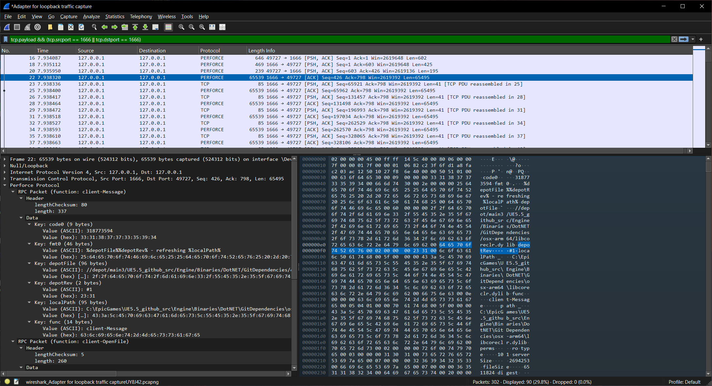

# Perforce P4 Wireshark Dissector

This repository contains a custom Wireshark dissector for the Perforce P4 wire protocol. It enables detailed inspection of P4 protocol messages within Wireshark, aiding in debugging and analysis of Perforce network traffic.

This is particularly useful if you are writing a Perforce plugin using the P4 C/C++ SDK and you want to verify that your app is doing the same thing as the P4 client.

## Features

- Decodes Perforce P4 protocol messages.
- Provides detailed insights into P4 network communication.
- Seamlessly integrates with Wireshark for enhanced debugging.

## Screenshot



## Installation Instructions

1. Clone this repository:
    ```bash
    git clone https://github.com/yourusername/perforce_p4_wireshark_dissector.git
    ```
2. Copy the dissector script `p4.lua` to your Wireshark plugins directory:
    - On Linux: `~/.local/lib/wireshark/plugins/`
    - On macOS: `~/Library/Application Support/Wireshark/Plugins/`
    - On Windows: `%APPDATA%\Wireshark\plugins\`
3. Restart Wireshark, or press CTRL+SHIFT+L to reprocess Lua scripts
4. Verify the dissector is loaded by navigating to `Help > About Wireshark > Plugins`.

## Usage

Once installed, open a capture file containing Perforce P4 traffic. The dissector will automatically decode and display P4 protocol messages in the packet details pane.

## Contributing

Contributions are welcome! Please submit issues or pull requests to improve the dissector.

## License

This project is licensed under the [Unlicense](LICENSE).
